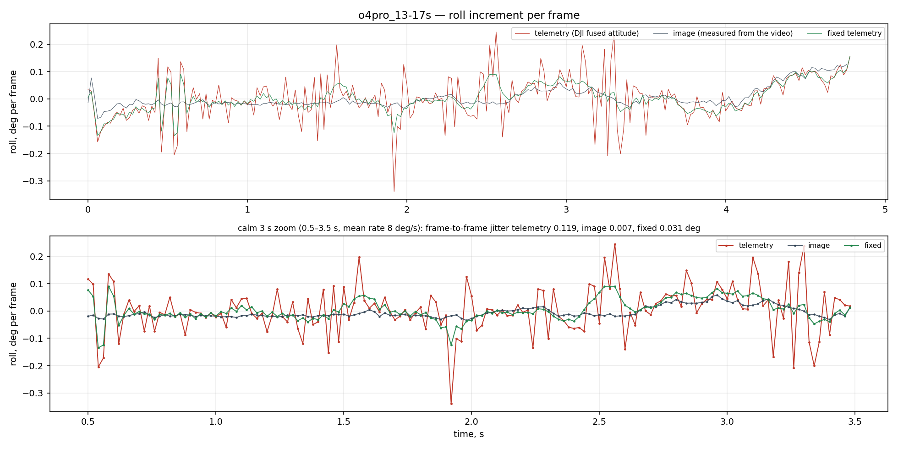

# GyroGate fix: repairing DJI O4 / O4 Pro telemetry for Gyroflow

**English** | [Русский](README.ru.md)

**The bug ("GyroGate").** Since February 2026 DJI ships the O4 Pro air unit with a
different gyro, the ICM‑40609‑D (marked I469D), the same part the O4 Lite has had
since launch. Footage from many of these units is fine straight from the camera
but judders once stabilized, in RockSteady and in Gyroflow alike. DJI confirmed the
sensor change and has shipped no fix. What the camera writes into the video is not
raw gyro but a *fused attitude* (quaternions in the `djmd` track), and that attitude
disagrees with what the camera actually did:

- **one‑frame spikes:** single frames report a yaw or pitch jump of up to 1.8°
  (88 °/s) that never happened, so Gyroflow yanks the frame for one frame;
- **roll jitter:** the reported roll trembles by ~0.1° from frame to frame while
  the image is smooth (≈0.01° measured from the same video), so the stabilized
  frame shivers clockwise‑counterclockwise even on a calm flight.

No smoothing setting removes a one‑frame error without smearing it onto the
neighbours, and Gyroflow itself is not at fault: it reads exactly what DJI wrote
(checked against its own CLI export, 1e‑3°).

**The fix.** This tool measures the camera's real rotation from the video itself
(OpenCV feature tracking through DJI's own lens model), repairs the telemetry
against that measurement frame by frame, and writes a small MP4 that Gyroflow
loads as external **motion data**. The video is not touched. Run
`python src/main.py clip.MP4` or drop the clip onto `fix_telemetry.bat`; the
fixed telemetry appears next to the clip.



*O4 Pro, calm flight, roll increment per frame: red is DJI's telemetry, grey is
the rotation measured from the video, green is the repaired telemetry.
More in [`examples/`](examples/); [`docs/HANDOFF.md`](docs/HANDOFF.md) §0 has the
technical state.*

**Related tools.** [DJI_04_Air_Unit_Gyro_Patcher](https://github.com/gmatocha/DJI_04_Air_Unit_Gyro_Patcher)
finds burst glitches by their magnitude and bridges them with SLERP;
[DJIGyroFix](https://github.com/kim2160/DJIGyroFix) smooths user‑selected time
ranges. Both rewrite the telemetry inside a copy of the MP4 from the telemetry
alone. This project differs in that the reference is the video: every correction
is measured against the image, single‑frame spikes are removed without touching
their neighbours, roll jitter is repaired as well, and the result is a separate
motion‑data file.

## Quick start

```bat
fix_telemetry.bat "F:\36\video.MP4"
```

or

```bash
python src/main.py "F:\36\video.MP4"
```

The result is two files next to the video:

| file | what |
|---|---|
| `<name>_telemetry_fixed.mp4` | ~5 MB, load into Gyroflow: Motion data → open file |
| `<name>_overview.png` | three panels of angular rates: telemetry, image, fixed; events shaded red, spikes marked by purple lines |

Everything else intermediate is deleted; `--keep` leaves it next to the video:

| file | what |
|---|---|
| `<name>_00_control.mp4` | same timing, contents untouched — the control for an A/B |
| `<name>_image.npz` | the rotation measured from the image, cached (~0.17 s per 4K frame, reused) |
| `<name>_fix_report.json` | what was corrected and by how much, the list of events with their verification |
| `<name>_verify.json` | the image's verdict: timing, roll jitter by speed band, pitch/yaw |

If the camera does not have the stock lens, name a Gyroflow profile — for an O4
Lite with the Flywoo O4 Wide, for example: `fix_telemetry.bat "F:\clip.MP4" --lens flywoo`
(see `lens_profiles/README.md`).

`main.py` flags: `--keep`, `--plots` (three more plots: roll, pitch/yaw,
correction), `--no-plots` (draw nothing at all), `--lens`, `--artifacts` (write
into `artifacts/main/<name>/`, for development), `-o DIR`, `--no-image` (skip the
video pass: timing + Wiener), `--backend gpu` (tracking on the GPU through
OpenCL, twice as fast, but the measurement is slightly different: some pitch/yaw
event verdicts change — do not mix backends on one clip), `--remeasure`,
`--gain 0.7`, `--r0`, `--no-events`, `--timing dbgi` (the old alignment, for
A/B), `--extract`, `--no-verify`, `--gyroflow PATH` (Gyroflow.exe for the final
cross‑check; by default the `GYROFLOW` environment variable, then the standard
install folders; without Gyroflow the cross‑check is skipped). The fine event
parameters live in `src/fix_pipeline.py` (see `--help`). Dependencies: `numpy`,
`scipy`, `opencv-python` (`matplotlib` for the plots; without it everything else
still works, the overview picture simply is not drawn).

## What is fixed and why

1. **Timing.** Gyroflow reads a frame's attitude at `pts` (the middle row when
   rolling‑shutter correction is on), the same way for embedded and for external
   telemetry. Measured from the image on two cameras: `pts` is correct to ~1 ms.
   A constant shift is therefore measured on the clip (it comes out ≈0), and per
   frame half the change of exposure relative to the median is added. The old
   alignment against the `dbgi` anchor (`align.py`, +10.5 ms on the Pro) was
   ~10 ms late: on the Lite the same anchor gives a shift of the opposite sign.
2. **Roll.** DJI's fused attitude trembles in roll by ~0.12°/frame regardless of
   the real motion. The roll measured from the image (pure rotation of the rays
   between neighbouring frames, `measure_rotation.py`) replaces it above 4 Hz
   with a speed‑dependent weight (R0 = 40 °/s), as in `rollfix.py`. The roll axis
   is z of the telemetry frame (its agreement with the camera axes was confirmed
   by a windowed homography on the fast sections).
3. **Pitch/yaw noise.** A Wiener gain curve above 4 Hz, calibrated on the clip
   where possible; below 4 Hz nothing is touched.
4. **Spikes and pitch/yaw events.** The Lite's main defect turned out to be
   single‑frame spikes of the fused attitude: a yaw jump of 1.77° in one frame
   against 0.3° in its neighbours (55.72 s), and Gyroflow honestly yanks the
   frame. Such frames are found from the telemetry itself (deviation from the
   local median ≥0.35°/frame), confirmed against the image (which shows no jump)
   and returned to the local median before all the filters, so that the filters
   never "see" the spike (otherwise the Wiener filter smears it onto the
   neighbouring frames).
   Longer events (image and telemetry diverging by ≥0.1°/frame and by at least
   half of the motion itself, ≥0.1 s) are corrected to the per‑frame shape of the
   image with a zero total over the window. Every event is independently checked
   against the shift channels of the affine flow; only confirmed events (and the
   spikes) are applied, unclear and contradicting ones are dropped
   (`fix_pipeline.py --unclear-weight`). There is no ceiling on the magnitude
   (`fix_pipeline.py --event-max-deg`). Visually checked by the user on both
   clips on 2026‑09‑15.

Every step is measured, not assumed: `verify_fix.py` judges any sidecar against
the image without a render, and at the end `main.py` checks through the Gyroflow
CLI that Gyroflow reads the file exactly as it was written (discrepancy 1e‑3°).

## Results

Short pieces in `examples/`, one defect per camera:

| | before | after | from the image |
|---|---|---|---|
| O4 Pro, roll jitter over a calm 3 s, °/frame | 0.11 | 0.019 | 0.0075 |
| O4 Lite, yaw jump at frame 55.72 s, ° | 1.76 | 0.03 | 0.24 |
| O4 Lite, yaw jump at frame 55.82 s, ° | 0.68 | 0.00 | 0.17 |

Full clips, 92 s each. Roll jitter here is the RMS frame‑to‑frame change of the
roll rate, °/frame. "Image" is the same quantity measured from the video; the
telemetry cannot go below that.

| clip | band | before | after | image |
|---|---|---|---|---|
| O4 Pro | calm <20 °/s | 0.075 | 0.044 | 0.037 |
| O4 Pro | 20–60 °/s | 0.090 | 0.074 | 0.059 |
| O4 Pro | fast >60 °/s | 0.85 | 0.85 | 0.72 |
| O4 Lite | calm <20 °/s | 0.051 | 0.046 | 0.041 |
| O4 Lite | 20–60 °/s | 0.089 | 0.088 | 0.080 |
| O4 Lite | fast >60 °/s | 0.45 | 0.46 | 0.30 |

On the full Lite clip 11 spikes were removed: 19.76, 25.78, 25.98, 26.10,
37.24–37.34, 41.14, 55.72, 55.82 and 91.54 s. The pitch and yaw disagreement with
the image at the 99th percentile went 0.59 → 0.50 °/frame. The Lite's roll is
nearly clean as it is. Above 60 °/s nothing is corrected: the image is blurred
and the telemetry is more accurate than it is there. The pitch and yaw
corrections on the Pro have only been checked by eye — the image understates
their magnitude (see "Limitations"). The `<name>_verify.json` and
`<name>_fix_report.json` reports stay next to the video with `--keep`.

## Examples

`examples/` holds two short pieces with telemetry, one per camera, each with a
`run.bat`, the result and the plots. The clips themselves (~70 MB each) are not
part of the repository: download `o4pro_13-17s.MP4` and `o4lite_53-58s.MP4` from
the Releases page and put them into the matching folders; `run.bat` without a
clip says the same.

- `examples/o4pro_13-17s/` — O4 Pro, stock lens: frame‑to‑frame roll jitter
  (0.1105 → 0.0187 °/frame against an image floor of 0.0075).
- `examples/o4lite_53-58s/` — O4 Lite with the Flywoo O4 Wide lens (run with
  `--lens flywoo`): single‑frame yaw spikes in the telemetry at 55.72 and
  55.82 s (1.76 and 0.68° in one frame) that made Gyroflow yank the frame.

Each folder has a `README.md` with the before/after numbers and with what is
still not perfect.

## Limitations, honestly

- The image measures pitch and yaw at an understated scale (0.5–0.75 on the
  Lite, 0.7–0.95 on the Pro): with a short baseline, the drone's translation over
  the ground is inseparable from rotation. The event repair therefore relies on
  the *change* of the disagreement over fractions of a second rather than on its
  magnitude, the total over the window is zeroed, and only events confirmed by a
  second channel are applied. Roll does not have this problem (gain ~1.0 on both
  cameras).
- The lens model is taken from the clip's telemetry by default. If the camera
  carries a different lens (the test Lite had a Flywoo O4 Wide), pass the same
  profile that is selected in Gyroflow: `--lens flywoo` (part of a file name in
  `lens_profiles/`, where the Flywoo O4 Wide profile lives) or
  `--lens path/to/profile.json` from the github.com/gyroflow/lens_profiles
  database. Roll and spike removal do not depend on the lens; the pitch/yaw
  agreement with the telemetry on the Lite improved with the correct profile
  (residual 0.73° → 0.56°/frame), but the understated scale remained both on the
  Lite and on the Pro with its stock lens: this is parallax, not the lens. That
  is why `--fit-focal` (fitting the focal scale against the telemetry on the fast
  frames) is diagnostic only and is applied only if the gains reach 1; on both
  test clips it correctly refuses.
- Faster than ~60 °/s the image is blurred; nothing is corrected there.
- Roll below 4 Hz is left to the telemetry: the integral of the image
  measurement drifts.

## Verifying and comparing files

```bash
python src/verify_fix.py <video> --image <clip_image.npz> <sidecar1.mp4> [<sidecar2.mp4> ...]
```

For each file: the timing shift relative to `pts` at which the telemetry's roll
best matches the image (for a fixed file it should be 0 ± 2 ms), the roll jitter
by speed band against the image floor, and the pitch/yaw disagreement over the
verified windows.

A Gyroflow export without a render (absolute paths, do not run it in a loop):

```bash
Gyroflow.exe video.MP4 -g sidecar.mp4 --export-metadata "3:C:\abs\camera.json" -f
```

A note from the Gyroflow 1.6.3 sources (`external/gyroflow`): with `-g` the CLI
does not parse the video's own telemetry, so `frame_readout_time` in the project
stays 0 and a type 3 export is stamped exactly at `pts`; in the GUI the readout
value from the video is kept if the video is loaded first. A type 3 export with
readout > 0 stamps `pts + readout/2`, while the render takes the middle row at
`pts`.

## Files

| file | what |
|---|---|
| `src/main.py`, `fix_telemetry.bat` | entry point |
| `src/measure_rotation.py` | one pass over the video: roll and shifts from the affine flow (raw and in normalized coordinates), pure rotation from frame pairs, homography and pure rotation over windows of 5 frames |
| `src/fix_pipeline.py` | assembling the fixed telemetry and the control file, the report |
| `src/timing.py` | per‑frame timing |
| `src/verify_fix.py` | the image's verdict |
| `src/dji_o4.py` | CLI: `extract`, `dump`, `sidecar`, `gcsv`, `patch`, `verify`; parsing `djmd` |
| `src/sidecar.py`, `src/mp4parse.py`, `src/pb.py`, `src/quat.py` | sidecar MP4, ISO‑BMFF, protobuf, quaternions |
| `src/telemetry.py` | loading `.npz`, vector operations, writing a sidecar |
| `src/rotmath.py` | quaternion maths, shared by everything |
| `src/align.py`, `src/rollfix.py`, `src/denoise.py` | the earlier methods; `denoise.py` supplies the Wiener curves to the pipeline, `align.py` the `--timing dbgi` mode |
| `src/imagerot.py` | measurements from the image: LK tracking, Kabsch, affine flow, homography |
| `research/` | research scripts and the session pipeline (history), see `docs/PROJECT_STRUCTURE.md` |
| `external/` | Gyroflow and telemetry-parser sources for cross‑checking (not in the repository, see `external/README.md`) |

## Comparing telemetry before and after stabilization (the session pipeline)

The scripts live in `research/session/`. `compare_stabilization_telemetry.py`
matches the source's DJI telemetry against the image motion of the source and of
the stabilized video. The paths to the two videos and the interval parameters are
at the top of the file. Every run creates its own
`artifacts/sessions/YYYYMMDD_HHMMSS` folder with three identically laid out CSVs,
two plots, a description of the session and a JSON listing the suspicious
intervals.

```bash
python research/session/compare_stabilization_telemetry.py
python research/session/analyze_telemetry_outliers.py artifacts/sessions/YYYYMMDD_HHMMSS
python research/session/create_telemetry_bugfix.py artifacts/sessions/YYYYMMDD_HHMMSS
python research/session/evaluate_telemetry_fix.py
```

This pipeline needs a stabilized render and remains an analysis tool. Fixes of
2026‑09‑14: the time grid of the rates was shifted by `readout/2` (the inserted
detail used to land out of phase), the corrections of all models are bounded by
`max_correction_deg`, and a metric of the absolute deviation over a window was
added to the evaluation. The `large_impulse` class (a burst in the output while
the gyro and the image agree) is not proof of a telemetry error; the justified
criterion is `gyro_fault`.

## Trimming video while keeping the telemetry

Set three parameters at the top of `src/trim_video.py` and run
`python src/trim_video.py`:

```python
FILE = r"F:\36\DJI_20260905181949_0005_D.MP4"
START = "00:10"  # None — from the beginning
END = "00:15"    # None — to the end
```

The boundaries are widened to keyframes, all tracks (`djmd`, `dbgi`) are cut at
the same frame numbers, DJI's absolute timestamps are preserved, and the file is
read back and checked. A trimmed clip can be put through `main.py` as usual. More
in `docs/`. Tests: `python -m unittest discover -s tests`.

## What is in the file

`djmd` is protobuf `dvtm_O4P.proto`/`dvtm_O4.proto`: 40 quaternions per frame
(2000 Hz nominally, the fusion updates at 1000 Hz, every value twice), the sensor
readout time (Pro 13.58 ms, Lite 18.13 ms), focal length and distortion (OpenCV
fisheye), exposure and ISO per frame. DJI does not write raw gyro data. The
conversion to Gyroflow's frame is
`q_cam = (0,0,1,0) ⊗ q ⊗ (0.5,-0.5,-0.5,0.5)` plus a continuity sign; the time
scale reproduces telemetry-parser exactly (all timestamps match Gyroflow's own
parsing). A detailed field map and the research history are in
[`docs/HANDOFF.md`](docs/HANDOFF.md).

## Sample clips wanted

The tool was developed on two 2025 units. If you have a 2026 O4 Pro (serial
`9F2KP2…` or later, I469D gyro) with juddering stabilization, send a short piece
of the original MP4 with its telemetry: 5–10 s, not re‑encoded, ideally with a
note of where it judders. Clips where the tool does not help are just as useful.

Where: the pinned "Clips wanted" issue in
[Issues](https://github.com/parhipov/DJIFix/issues); upload the file anywhere you
like and post the link in the issue. Personal contact details are on the GitHub
profile.

## License

MIT, see `LICENSE`. The Gyroflow and telemetry-parser sources in `external/` are
not part of the repository and are distributed under their own licenses.
